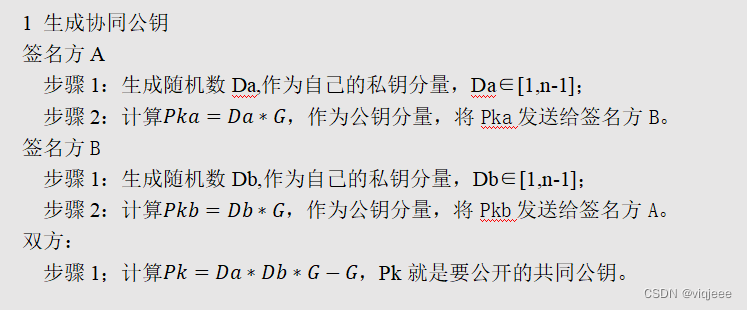
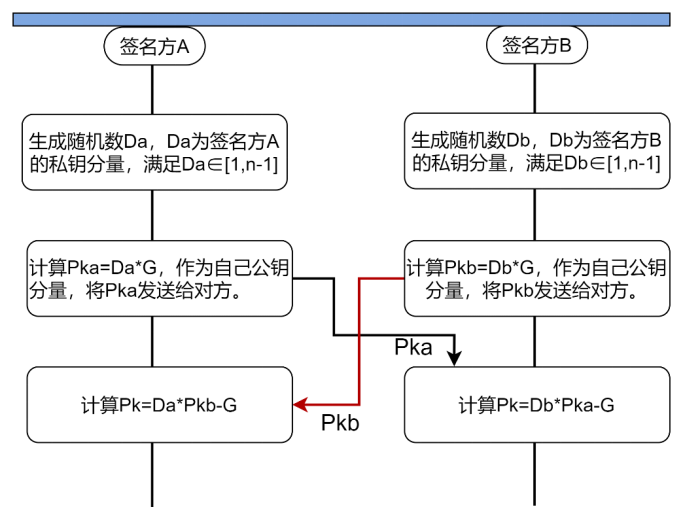
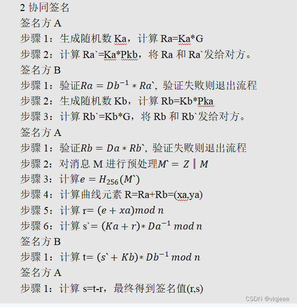
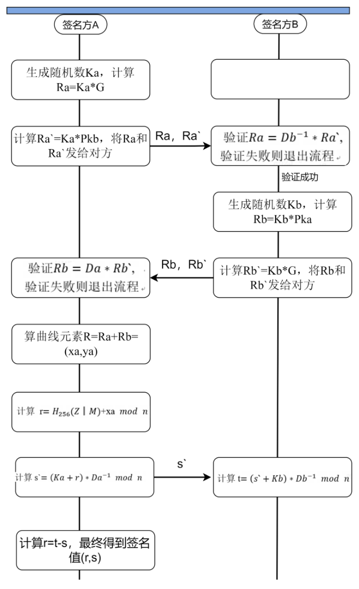

## Two-Party Signature Scheme

This is a two-party signature scheme implemented in Golang. The scheme is based on the paper "Two-party signature schemes for anonymous credentials" by Boneh, Boyen, Goldfeder, and Johansson.

The scheme is secure under the assumption that the adversary cannot learn anything about the private key of the signer.

The scheme is implemented as a class with two methods: `sign` and `verify`. The `sign` method takes a message and returns a signature. The `verify` method takes a message and a signature and returns a boolean indicating whether the signature is valid.

